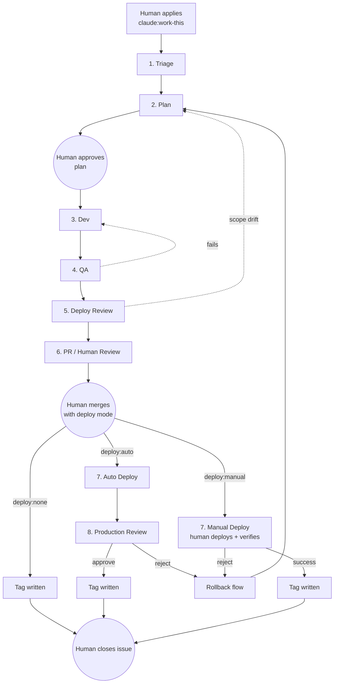
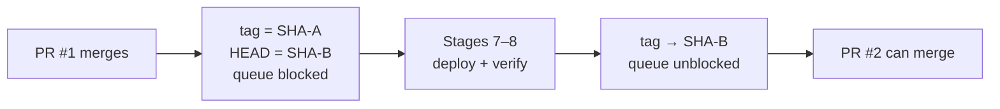
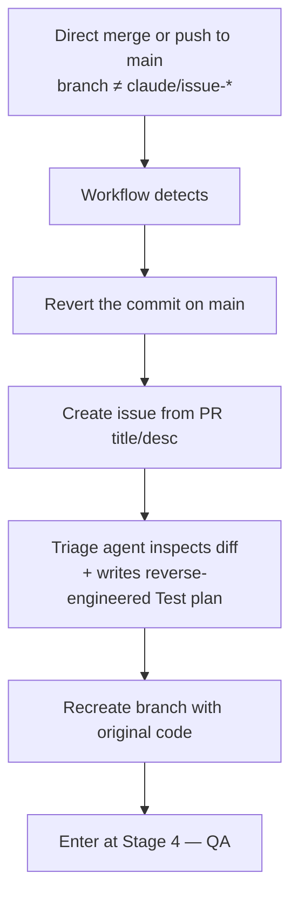
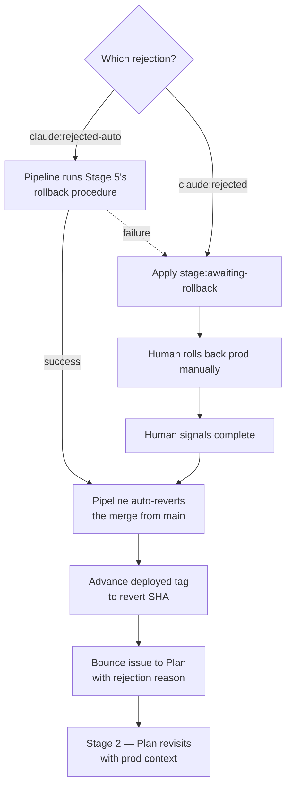

# Pipeline

The eight-stage issue-to-production pipeline in detail.

- For the higher-level design and locked-in decisions, see [CLAUDE.md](./CLAUDE.md).
- For setup and getting started, see [README.md](./README.md).

## Overview

Each stage runs as a single GitHub Actions workflow on the consuming repo's runner. The workflow invokes its agent, reads the structured output, posts a comment to the issue, flips labels, and exits. The next stage fires when the label change reaches GitHub's events stream.

## Stages

### Stage 1 — Triage

| | |
|---|---|
| **Owner** | Triage agent |
| **Trigger** | Human applies `claude:work-this` to an open issue |
| **Reads** | Issue title, description, comments; repo state |
| **Posts** | Scope summary, unknowns, decision |

**Decisions**
- `READY` — scope is clear, advances to Stage 2
- `ASK` — questions for the human; applies `claude:awaiting-approval`
- `SPLIT` — proposes child issues; applies `claude:awaiting-approval`

---

### Stage 2 — Plan

| | |
|---|---|
| **Owner** | Plan agent |
| **Trigger** | Label moves to `stage:plan` |
| **Reads** | Triage output, repo state, consumer's `CLAUDE.md` if present |
| **Posts** | Detailed plan: file-level scope, deploy considerations, test plan |
| **Gate** | Always applies `claude:awaiting-approval` — every plan gates on a human signal |

**Exit**
- Human removes `claude:awaiting-approval` → Stage 3
- Human applies `claude:rejected` → bounces to Triage

**Exception:** reverse-engineered work (from non-pipeline merges) skips this stage entirely. See [Non-pipeline merges](#non-pipeline-merges).

---

### Stage 3 — Development

| | |
|---|---|
| **Owner** | Dev agent |
| **Trigger** | Label moves to `stage:dev` |
| **Reads** | Plan, repo state |
| **Writes** | Code, committed to `claude/issue-<N>-<slug>` |
| **Posts** | Summary of what changed |

**Exit:** branch has commits; advances to Stage 4.

---

### Stage 4 — Verification (QA)

| | |
|---|---|
| **Owner** | QA agent |
| **Trigger** | Label moves to `stage:qa` |
| **Reads** | Plan's Test plan section |
| **Runs** | Rebase on `main` → unit tests → live-env validation |

**Bounce conditions (back to Dev)**
- Merge conflicts on the rebase (main moved in a way that conflicts)
- Tests pass on the branch but fail after the rebase
- Unit tests fail
- Live-env validation fails

The rebase happens **first**, so QA always validates the state that will actually land.

**Exit:** all checks pass; advances to Stage 5.

---

### Stage 5 — Deploy Review

**Stage 5's comment is the contract for Stages 7–8.** The dev-ops agent inspects the project (Dockerfile, K8s manifests, deploy scripts, registry config, cloud provider hints, consumer's `CLAUDE.md`, etc.) and writes a structured comment:

| Field | Purpose |
|---|---|
| Deploy description | Human-readable summary of what deploying this PR will do |
| `deploy:auto-available` | `yes` / `no` — does the agent know how to deploy this confidently? |
| Deploy procedure | Machine-readable steps Stage 7 executes if auto is chosen |
| `rollback:auto-available` | `yes` / `no` — does the agent know how to roll back confidently? |
| Rollback procedure | Parameterized by target SHA; consumed by Stage 8 on `claude:rejected-auto` |
| What to verify in prod | Surfaced into the Stage 8 review comment |

**Special case:** if the diff is doc-only / no infra impact, the agent pre-applies `deploy:none` and Stages 7–8 are skipped entirely.

**Bounce condition (back to Plan):** scope drift — infra concerns surfaced that the Plan didn't account for.

**Exit:** Stage 5 comment posted; advances to Stage 6.

---

### Stage 6 — PR / Human Review

| | |
|---|---|
| **Owner** | Human (with PR-prep agent assistance) |
| **Trigger** | Label moves to `stage:pr` |
| **Workflow does** | Opens a PR from the branch to `main`, surfaces Stage 5's findings |

**What the human does**
1. Reviews the PR
2. Applies exactly one deploy-mode label:
   - `deploy:auto` (only if Stage 5 said it's available)
   - `deploy:manual`
   - `deploy:none` (pre-applied by Stage 5 for doc-only)
3. Merges the PR

**On merge**

| Label | Effect |
|---|---|
| `deploy:none` | Tag written immediately, advances to closure |
| `deploy:auto` | Label → `stage:deploy`, fires Stage 7A |
| `deploy:manual` | Label → `stage:deploy`, fires Stage 7B |

**No auto-merge.** The human always merges.

---

### Stage 7 — Deploy

Two paths, chosen by the human at Stage 6.

#### 7A — Auto deploy

**Owner:** Deploy agent (re-running on the runner)

- Reads Stage 5's deploy procedure from the issue comments
- Executes the procedure on the runner

| Outcome | Result |
|---|---|
| Success | Label → `stage:prod-review`, advances to Stage 8 |
| Failure | **Hard human gate** — applies `claude:awaiting-approval` with deploy logs. No bounce, no retry |

#### 7B — Manual deploy

**Owner:** Human

The workflow applies `claude:awaiting-approval` and posts a comment with: merged SHA, what to deploy (from Plan), and manual rollback instructions.

The human deploys out-of-band, verifies it themselves (they are both deployer and verifier), then signals:

| Action | Result |
|---|---|
| Remove `claude:awaiting-approval` | **Tag is written immediately.** Advances to closure |
| Apply `claude:rejected` | Enters [rollback flow](#stage-8-rejection--rollback) |

**Manual deploy skips Stage 8** — verification is collapsed into the single human signal because the human already did both.

---

### Stage 8 — Production Review

| | |
|---|---|
| **Owner** | Human |
| **Path** | Auto-deploy only |
| **Trigger** | Label moves to `stage:prod-review` |
| **Workflow does** | Applies `claude:awaiting-approval`. Posts merged SHA, deploy run URL, what to verify (from Stage 5), and the rollback options |

**What the human does — three choices**

| Action | Label | Result |
|---|---|---|
| Approve | Remove `claude:awaiting-approval` | Tag written → advances to closure |
| Reject + auto-rollback (only if `rollback:auto-available`) | Apply `claude:rejected-auto` | Pipeline runs Stage 5's rollback procedure → main-revert + bounce to Plan |
| Reject + manual rollback | Apply `claude:rejected` | Pipeline applies `stage:awaiting-rollback` → human rolls back manually → signals → main-revert + bounce to Plan |

See [Stage 8 rejection / rollback](#stage-8-rejection--rollback) for the detail flow.

---

## Closure

After the pipeline reaches its end:
- The `deployed` tag is written
- The pipeline posts a final summary comment (total cost, time, bounces, deployed SHA)
- **The human closes the issue manually.** Closure was not moved to auto in any path.

---

## Tag-gated serialization

Branch protection on `main` requires `HEAD == deployed` tag. This serializes the post-merge phase: while any ticket is in Stages 7–8, no other PR can merge.

- **Tag is written** when a human signs off in prod: Stage 8 approval (auto-deploy) or Stage 7 signal-complete (manual). Or immediately on merge for `deploy:none` PRs.
- **Tag is NOT written** on Stage 7 auto-deploy success alone — that would unblock the queue while prod is still being human-verified.
- **Bootstrap:** if no `deployed` tag exists yet, the check passes. First ticket through writes the tag.

Tag mechanism (git moving tag, GitHub Deployments API, or `production` tracking branch) is an open implementation choice — all three satisfy the design.

---

## Non-pipeline merges

Anything that reaches `main` without going through the pipeline gets caught and re-routed.

**Key points**
- **No emergency bypass.** Hotfixes pay the full validation cost.
- **Plan stage is skipped.** The act of merging directly is the implicit Plan approval. This is the one explicit exception to the "every Plan gates on human approval" rule.
- **Test plan is best-effort.** The agent infers from the diff only — no design context.
- **If QA fails**, the Dev agent fixes the code like any other Dev output — the human's original implementation may be mutated.

---

## Stage 8 rejection / rollback

**State of the three references through the flow**

|  | Before rejection | After rejection (idle) | After rollback signal | After main-revert |
|---|---|---|---|---|
| `deployed` tag | SHA-A | SHA-A | SHA-A | SHA-A' (the revert) |
| `main` | SHA-B | SHA-B | SHA-B | SHA-A' (the revert) |
| Production | SHA-B | SHA-B until human acts | SHA-A | SHA-A |

The queue stays blocked from rejection until main-revert completes — which is correct, because prod is in a bad state.

The 3-bounce rule applies to repeated Stage 8 → Plan bounces. If a ticket gets rejected three times, the workflow halts and asks for human intervention.

---

## Bounce semantics

| Bounce pair | Cause | Counter label |
|---|---|---|
| QA → Dev | Tests fail, conflicts on rebase | `bounce:qa-dev:N` |
| Deploy Review → Plan | Scope drift discovered in infra review | `bounce:deploy-review-plan:N` |
| Plan → Triage | Plan rejected by human | `bounce:plan-triage:N` |
| Stage 8 → Plan | Prod rejection | `bounce:prod-review-plan:N` |

- **Within a single stage**: up to 3 internal agent retries before bouncing
- **Across stage pairs**: stops at 3 bounces, then halts and applies `claude:awaiting-approval` for human intervention

---

## Audit trail

Every state change posts a short comment to the issue:

- Stage transitions
- Label flips
- Bounces (with reason)
- Retries
- Approval gates opened and closed
- Deploy run URLs, rollback procedure runs

The issue's comment thread **is** the audit log. Cost markers (`💰 Cost: $X (this run) | $Y (issue total)`) carry the running total forward stage to stage.
